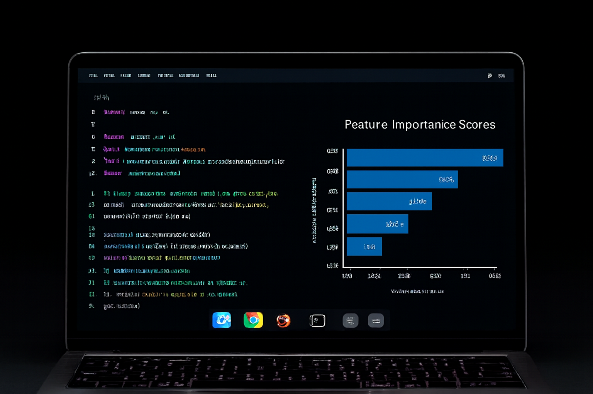

  

# Data. Insight. Impact.

Aspiring **Data Scientist** passionate about making an impact by solving real-world problems through data.  
I enjoy transforming raw data into insights, building predictive models, and exploring new techniques in AI.

---

## 💻 Skills

- **Programming:** Python, SQL  
- **Data Analysis:** Pandas, NumPy  
- **Machine Learning:** Scikit-learn, XGBoost, Decision Trees, Neural Networks  
- **Visualization:** Matplotlib, Seaborn, Tableau  
- **Other:** Git, Jupyter Notebook, Data Cleaning, Feature Engineering  

 <!-- XGBoost -->

---

## 📫 Email Me  

**Email:** [blaisewairimu@gmail.com](mailto:blaisewairimu@gmail.com)
